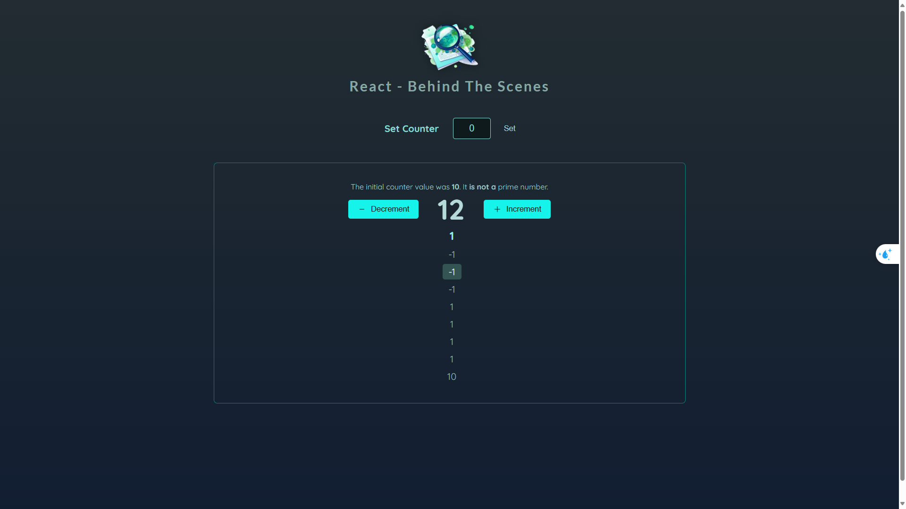

# Behind the Scenes

A React project demonstrating the behind-the-scenes workings of React components and state management.



## Description

This project showcases various React concepts and demonstrates how React works behind the scenes. It's built using modern React practices and tools.

## Technologies Used

- React 19
- Vite
- Million.js (for performance optimization)
- ESLint for code quality

## Getting Started

### Prerequisites

- Node.js (latest LTS version recommended)
- npm or yarn

### Installation

1. Clone the repository
2. Install dependencies:
```bash
npm install
```

### Development

To start the development server:

```bash
npm run dev
```

### Building for Production

To create a production build:

```bash
npm run build
```

### Preview Production Build

To preview the production build locally:

```bash
npm run preview
```

## Available Scripts

- `npm run dev` - Start development server
- `npm run build` - Build for production
- `npm run preview` - Preview production build
- `npm run lint` - Run ESLint

## Project Structure

```
behind_the_scenes/
├── src/           # Source files
├── public/        # Static assets
├── node_modules/  # Dependencies
└── ...
```

## License
Open license for everyone