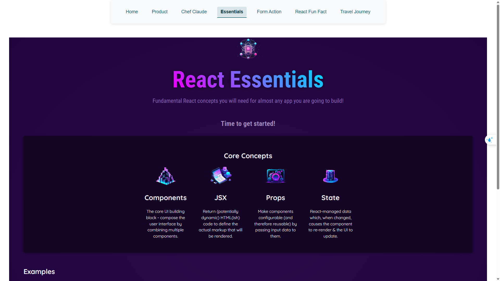
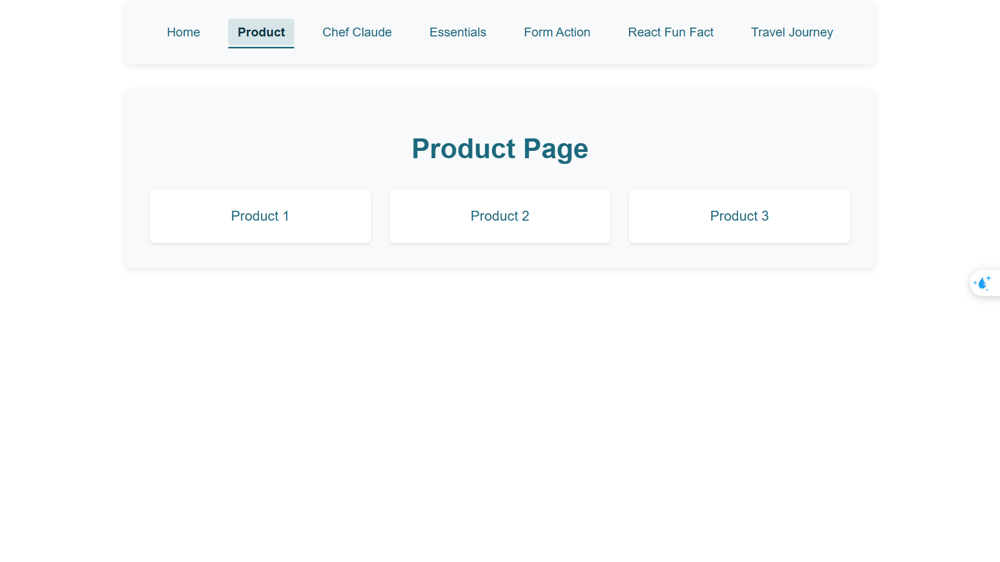

# React Core Concepts

<div align="center">
  
  <br/>
  
</div>

## 🚀 Overview

A comprehensive TypeScript-based React project that demonstrates fundamental React concepts and modern development practices. This project serves as both a learning resource and a practical implementation of React's core features.

## ✨ Features

- 🎯 TypeScript Integration
- 🛣️ React Router v7 for navigation
- 🎨 Modern UI Components
- 📱 Responsive Design
- 🔍 Prop Types Validation
- ⚡ Fast Development with Vite
- 🧪 Type Safety
- 🎭 Component Composition
- 🔄 State Management
- 🎯 Error Boundaries

## 🛠️ Tech Stack

### Core Technologies
- **React 19** - Latest version for optimal performance
- **TypeScript** - For type safety and better development experience
- **Vite** - Next-generation frontend tooling
- **React Router DOM v7** - Modern routing solution

### Development Tools
- **ESLint** - Code linting
- **Prettier** - Code formatting
- **TypeScript ESLint** - TypeScript-specific linting rules

## 📋 Prerequisites

- Node.js (v14 or higher)
- npm (v6 or higher)
- Basic understanding of React and TypeScript

## 🚀 Getting Started

### Installation

1. Clone the repository:
```bash
git clone <repository-url>
cd core_concepts
```

2. Install dependencies:
```bash
npm install
```

### Development

Start the development server:
```bash
npm run dev
```

The application will be available at `http://localhost:5173`

### Building for Production

Create a production build:
```bash
npm run build
```

Preview the production build:
```bash
npm run preview
```

## 📁 Project Structure

```
core_concepts/
├── src/                # Source files
│   ├── components/    # React components
│   ├── pages/        # Page components
│   ├── hooks/        # Custom React hooks
│   ├── types/        # TypeScript type definitions
│   └── utils/        # Utility functions
├── public/           # Static assets
├── types/           # Global type definitions
└── config/          # Configuration files
```

## 🛠️ Available Scripts

- `npm run dev` - Start development server
- `npm run build` - Build for production
- `npm run preview` - Preview production build
- `npm run lint` - Run ESLint

## 📚 Learning Resources

- [React Documentation](https://react.dev/)
- [TypeScript Documentation](https://www.typescriptlang.org/docs/)
- [Vite Documentation](https://vitejs.dev/guide/)
- [React Router Documentation](https://reactrouter.com/)

## 🎯 Key Concepts Covered

1. **Component Architecture**
   - Functional Components
   - Class Components
   - Component Composition
   - Props and State

2. **TypeScript Integration**
   - Type Definitions
   - Interfaces
   - Generics
   - Type Guards

3. **Routing**
   - Route Configuration
   - Navigation
   - Route Parameters
   - Protected Routes

4. **State Management**
   - Local State
   - Context API
   - Custom Hooks

## 🧪 Code Quality

The project maintains high code quality through:
- TypeScript for static type checking
- ESLint for code linting
- Prettier for consistent formatting
- Modern JavaScript best practices

## 🤝 Contributing

1. Fork the repository
2. Create your feature branch (`git checkout -b feature/AmazingFeature`)
3. Commit your changes (`git commit -m 'Add some AmazingFeature'`)
4. Push to the branch (`git push origin feature/AmazingFeature`)
5. Open a Pull Request

## 📝 License

This project is private and not licensed for public use.

## 💬 Support

For support, please:
- Open an issue in the repository
- Contact the development team
- Check the documentation

---

<div align="center">
  Made with ❤️ by [Your Name]
</div>
