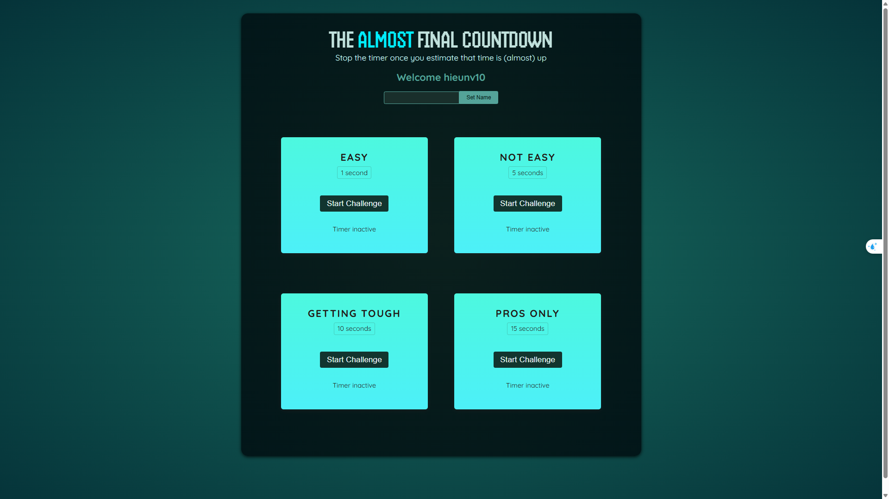

# Countdown Game

A React application that challenges players to stop a timer as close as possible to a target time, demonstrating the use of React refs, state management, and portals.



## Features

- Player name input and personalized welcome
- Multiple timer challenges with varying difficulty levels
- Real-time countdown timer
- Score calculation based on timing accuracy
- Modal display of results
- Win/lose conditions based on timing

## Technologies Used

- React 19.0.0
- Vite 4.4.5
- JavaScript (ES6+)
- React Portals for modal rendering
- React Refs for DOM manipulation

## Project Structure

- `src/components/` - Contains React components:
  - `Player.jsx` - Handles player name input and display
  - `TimerChallenge.jsx` - Core component for timer challenges
  - `ResultModal.jsx` - Displays results after a challenge is completed
- `src/assets/` - Contains static assets like images
- `src/App.jsx` - Main component that orchestrates the application
- `src/main.jsx` - Entry point of the application

## Getting Started

### Prerequisites

- Node.js (latest LTS version recommended)
- npm or yarn

### Installation

1. Clone the repository
   ```
   git clone <repository-url>
   cd countdown_game
   ```

2. Install dependencies
   ```
   npm install
   ```

3. Start the development server
   ```
   npm run dev
   ```

4. Open your browser and navigate to the URL shown in the terminal (typically http://localhost:5173)

## Available Scripts

- `npm run dev` - Starts the development server
- `npm run build` - Builds the app for production
- `npm run lint` - Runs ESLint to check for code issues
- `npm run preview` - Previews the production build locally

## How It Works

The Countdown Game challenges players to test their timing skills:

1. Players can enter their name for a personalized experience
2. The game offers four difficulty levels with different target times (1, 5, 10, and 15 seconds)
3. Players start a timer and try to stop it as close as possible to the target time
4. If the timer reaches zero, the player loses
5. If the player stops the timer before it reaches zero, a score is calculated based on how close they were to the target time
6. Results are displayed in a modal dialog
7. Players can try again with the same challenge or choose a different one

The application demonstrates several React concepts:
- Using `useRef` for direct DOM manipulation and storing values
- Using `useState` for reactive state management
- Using React Portals for rendering modals outside the normal DOM hierarchy
- Using `useImperativeHandle` to expose imperative methods to parent components

## License

This project is licensed under the MIT License - see the LICENSE file for details.