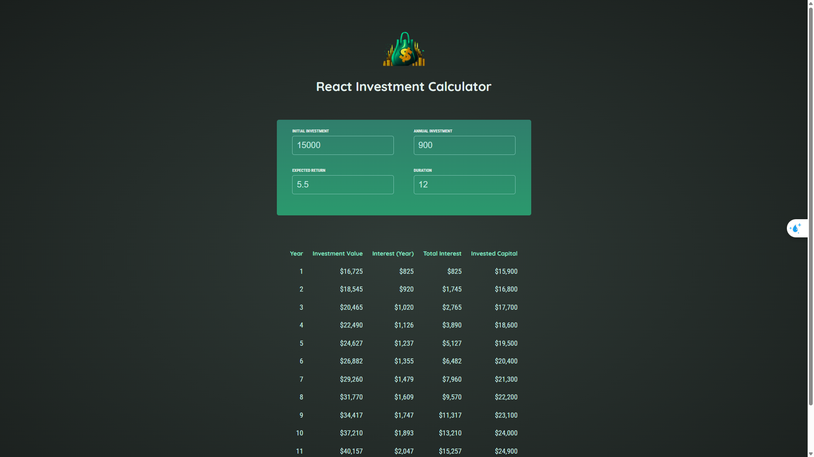

# Investment Calculator

A React application that helps users calculate and visualize the growth of their investments over time.



## Features

- Calculate investment growth based on:
  - Initial investment amount
  - Annual investment contribution
  - Expected annual return rate
  - Investment duration (in years)
- View detailed year-by-year breakdown of:
  - Total investment value
  - Interest earned each year
  - Cumulative interest earned
  - Total invested capital
- Real-time calculation updates as inputs change
- Responsive design for various screen sizes

## Installation

1. Clone the repository
2. Navigate to the project directory
3. Install dependencies:
   ```
   npm install
   ```
4. Start the development server:
   ```
   npm run dev
   ```

## Usage

1. Enter your initial investment amount
2. Specify your annual investment contribution
3. Set your expected annual return rate (as a percentage)
4. Define the investment duration (in years)
5. View the calculated results in the table below the input form

The application will automatically recalculate results whenever any input value changes.

## Technologies Used

- React 19.0.0
- Vite
- JavaScript (ES6+)
- CSS3
- HTML5

## Project Structure

```
investment_calculator/
├── public/             # Public assets
├── src/                # Source files
│   ├── assets/         # Static assets
│   ├── components/     # React components
│   │   ├── Header.jsx  # Application header
│   │   ├── InputItem.jsx # Individual input field
│   │   ├── Results.jsx # Results table component
│   │   └── UserInput.jsx # Input form component
│   ├── util/           # Utility functions
│   │   └── investment.js # Investment calculation logic
│   ├── App.jsx         # Main application component
│   ├── index.css       # Global styles
│   └── index.jsx       # Application entry point
├── index.html          # HTML entry point
├── package.json        # Project dependencies and scripts
└── vite.config.js      # Vite configuration
```

## Development

To run the development server with hot-reload:

```
npm run dev
```

To build the project for production:

```
npm run build
```

To preview the production build:

```
npm run preview
```