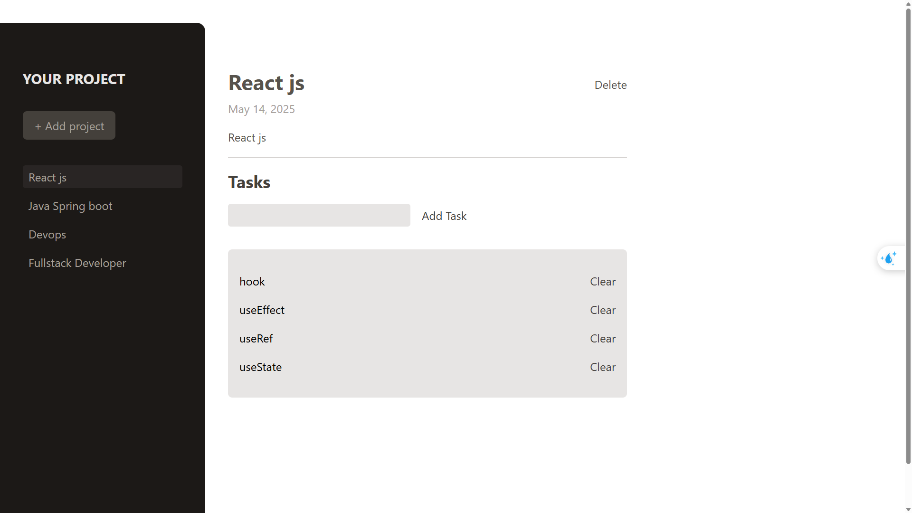

# Project Management Application

A React application for managing projects and tasks with a clean, modern interface built with React and TailwindCSS.



## Features

- Create and manage multiple projects
- Add tasks to each project
- Delete tasks and projects
- Interactive project selection
- Clean and responsive user interface
- Project sidebar navigation

## Technologies Used

- React 19.1.0
- Vite 6.3.5
- TailwindCSS 4.1.6
- JavaScript (ES6+)

## Project Structure

- `src/components/` - Contains React components:
  - `Button.jsx` - Reusable button component
  - `Input.jsx` - Reusable input component
  - `Model.jsx` - Modal dialog component
  - `NewProject.jsx` - Form for creating new projects
  - `NewTask.jsx` - Form for adding new tasks to a project
  - `NoProjectSelected.jsx` - Displayed when no project is selected
  - `ProductSideBar.jsx` - Navigation sidebar showing list of projects
  - `SelectedProject.jsx` - Displays details of the selected project
  - `Task.jsx` - Component for displaying individual tasks
- `src/assets/` - Contains static assets like images
- `src/App.jsx` - Main component that orchestrates the application
- `src/main.jsx` - Entry point of the application

## Getting Started

### Prerequisites

- Node.js (latest LTS version recommended)
- npm or yarn

### Installation

1. Clone the repository
   ```
   git clone <repository-url>
   cd management_project
   ```

2. Install dependencies
   ```
   npm install
   ```

3. Start the development server
   ```
   npm run dev
   ```

4. Open your browser and navigate to the URL shown in the terminal (typically http://localhost:5173)

## Available Scripts

- `npm run dev` - Starts the development server
- `npm run build` - Builds the app for production
- `npm run lint` - Runs ESLint to check for code issues
- `npm run preview` - Previews the production build locally

## How It Works

The application allows users to create and manage projects and their associated tasks:

1. Users can create new projects by clicking the "Add Project" button in the sidebar
2. Each project has a title, description, and due date
3. Once a project is created, users can select it from the sidebar
4. When a project is selected, users can add tasks specific to that project
5. Tasks can be deleted individually
6. Projects can be deleted, which also removes all associated tasks
7. The UI dynamically updates to reflect the current state of projects and tasks

The application uses React's useState hook for state management, with a structured state object that tracks:
- The currently selected project
- All projects with their details
- All tasks associated with projects

## License

This project is licensed under the MIT License - see the LICENSE file for details.
