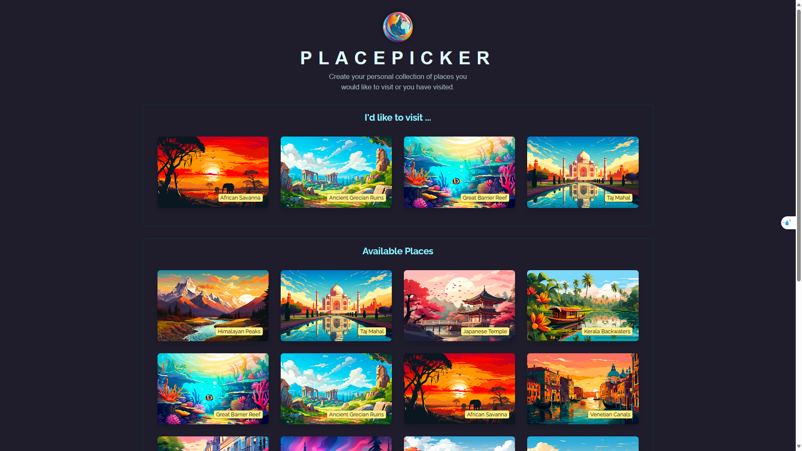

# Place Picker

A modern React application that allows users to pick and explore different places. Built with React and Vite for optimal performance and developer experience.



## Features

- Interactive place selection interface
- Modern and responsive design
- Smooth animations and transitions
- Efficient state management
- Optimized performance with Vite
- Location-based place sorting
- Persistent storage using localStorage

## Prerequisites

Before you begin, ensure you have the following installed:
- Node.js (Latest LTS version recommended)
- npm (comes with Node.js)

## Installation

1. Clone the repository:
```
git clone [repository-url]
cd place_picker
```

2. Install dependencies:
```
npm install
```

## Development

To start the development server:

```
npm run dev
```

This will start the development server at `http://localhost:5173` (or another port if 5173 is in use).

## Building for Production

To create a production build:

```
npm run build
```

The build artifacts will be stored in the `dist/` directory.

## Preview Production Build

To preview the production build locally:

```
npm run preview
```

## Project Structure

```
place_picker/
├── src/
│   ├── components/     # React components
│   ├── assets/        # Static assets
│   ├── App.jsx        # Main application component
│   ├── data.js        # Data management
│   ├── loc.js         # Location utilities
│   ├── main.jsx       # Application entry point
│   └── index.css      # Global styles
├── public/            # Public static files
├── index.html         # HTML template
└── vite.config.js     # Vite configuration
```

## Technologies Used

- React 19
- Vite 6
- ESLint for code quality
- Modern JavaScript (ES6+)
- Geolocation API
- localStorage for data persistence

## Scripts

- `npm run dev` - Start development server
- `npm run build` - Build for production
- `npm run preview` - Preview production build
- `npm run lint` - Run ESLint

## Contributing

1. Fork the repository
2. Create your feature branch (`git checkout -b feature/AmazingFeature`)
3. Commit your changes (`git commit -m 'Add some AmazingFeature'`)
4. Push to the branch (`git push origin feature/AmazingFeature`)
5. Open a Pull Request

## License

This project is licensed under the MIT License - see the LICENSE file for details. 