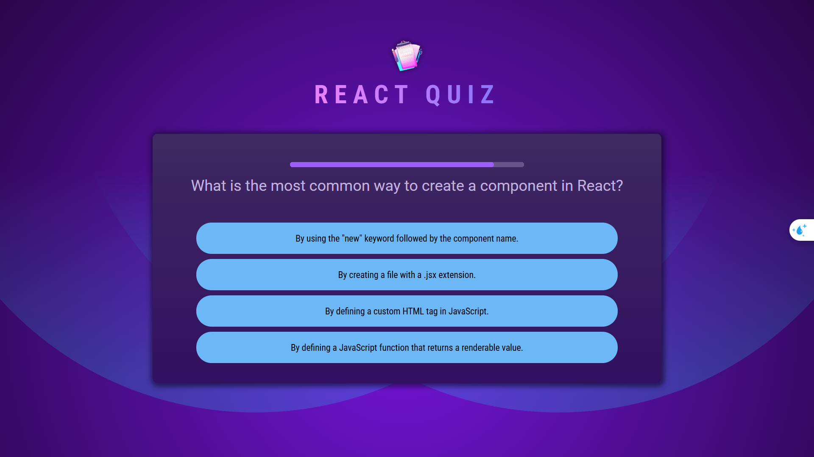
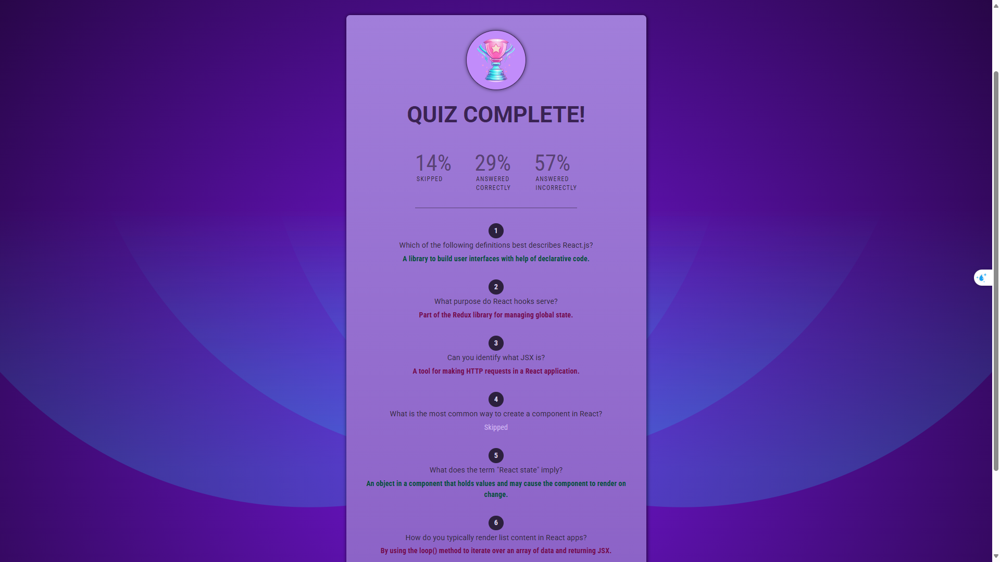

# 🎯 React Quiz Application

<div align="center">
  
  <br/>
  <em>Interactive Quiz Interface</em>
</div>

## 📋 Overview

A sophisticated quiz application built with React and Vite, offering an engaging and interactive learning experience. This application demonstrates modern React practices, state management, and responsive design principles.

## ✨ Key Features

- 🎮 **Interactive Interface**: Engaging user experience with smooth transitions and animations
- 📊 **Real-time Scoring**: Instant feedback and score tracking
- 🔄 **Dynamic Content**: Flexible question loading and management
- 📱 **Responsive Design**: Seamless experience across all devices
- 🎨 **Modern UI/UX**: Clean and intuitive interface design
- ⚡ **Performance Optimized**: Built with Vite for lightning-fast development and production builds

## 🛠️ Tech Stack

- **Frontend Framework**: React 19
- **Build Tool**: Vite
- **Language**: JavaScript (JSX)
- **Styling**: CSS3
- **Development Tools**:
  - ESLint for code quality
  - React Developer Tools
  - Vite Dev Server

## 🚀 Getting Started

### Prerequisites

- Node.js (LTS version recommended)
- npm (included with Node.js)
- Git

### Installation

1. **Clone the repository**
   ```bash
   git clone [your-repository-url]
   cd react_quiz
   ```

2. **Install dependencies**
   ```bash
   npm install
   ```

3. **Start the development server**
   ```bash
   npm run dev
   ```
   The application will be available at `http://localhost:5173`

## 📦 Available Scripts

| Command | Description |
|---------|-------------|
| `npm run dev` | Launch development server |
| `npm run build` | Create production build |
| `npm run preview` | Preview production build |
| `npm run lint` | Run ESLint for code quality |

## 📁 Project Structure

```
react_quiz/
├── src/
│   ├── components/     # Reusable React components
│   ├── assets/        # Static assets and images
│   ├── App.jsx        # Root application component
│   ├── main.jsx       # Application entry point
│   ├── questions.js   # Quiz data and logic
│   └── index.css      # Global styles
├── public/            # Public static files
└── index.html         # HTML template
```

## 🎨 Screenshots

### Quiz Interface

*Interactive quiz interface with dynamic question loading*

### Completion Screen

*Results and completion screen with score summary*

## 🤝 Contributing

We welcome contributions! Please follow these steps:

1. Fork the repository
2. Create your feature branch (`git checkout -b feature/AmazingFeature`)
3. Commit your changes (`git commit -m 'Add some AmazingFeature'`)
4. Push to the branch (`git push origin feature/AmazingFeature`)
5. Open a Pull Request

### Development Guidelines

- Follow the existing code style
- Write meaningful commit messages
- Update documentation as needed
- Add tests for new features

## 📄 License

This project is licensed under the MIT License - see the [LICENSE](LICENSE) file for details.

## 🙏 Acknowledgments

- [React Team](https://reactjs.org/) for the amazing framework
- [Vite Team](https://vitejs.dev/) for the fast build tool
- All contributors who have helped shape this project

---

<div align="center">
  Made with ❤️ by vanhieuhp
</div> 