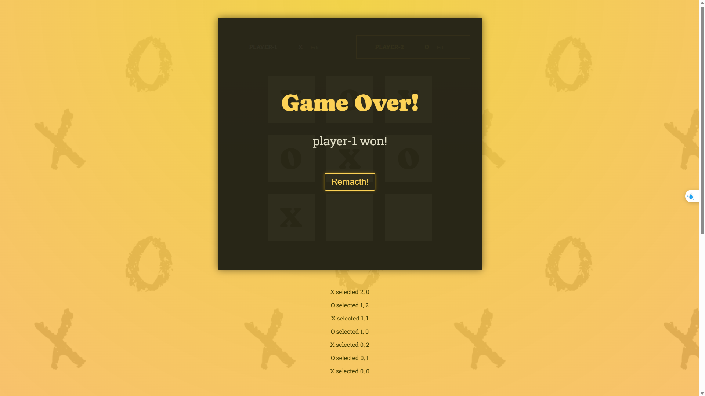

# Tic Tac Toe Game

A React application that implements the classic Tic Tac Toe game with modern React features including state management with useState and derived state.



## Features

- Interactive 3x3 game board
- Player name customization
- Turn tracking and display
- Automatic winner detection
- Game history log
- Game over screen with restart option
- Draw detection when no winner is found

## Technologies Used

- React 19.0.0
- Vite
- JavaScript (ES6+)
- CSS for styling

## Project Structure

- `src/components/` - Contains React components:
  - `GameBoard.jsx` - Renders the 3x3 game grid
  - `GameOver.jsx` - Displays game over state with winner and restart button
  - `Log.jsx` - Shows history of moves
  - `Player.jsx` - Manages player information and turns
- `src/winning-combination.js` - Contains logic for determining winning combinations
- `src/App.jsx` - Main component that orchestrates the game

## Getting Started

### Prerequisites

- Node.js (latest LTS version recommended)
- npm or yarn

### Installation

1. Clone the repository
   ```
   git clone <repository-url>
   cd tic_tac_toe_game
   ```

2. Install dependencies
   ```
   npm install
   ```

3. Start the development server
   ```
   npm run dev
   ```

4. Open your browser and navigate to the URL shown in the terminal (typically http://localhost:5173)

## Available Scripts

- `npm run dev` - Starts the development server
- `npm run build` - Builds the app for production
- `npm run lint` - Runs ESLint to check for code issues
- `npm run preview` - Previews the production build locally

## How It Works

The game follows the classic Tic Tac Toe rules where players take turns marking X and O on a 3x3 grid. The first player to get three of their marks in a row (horizontally, vertically, or diagonally) wins the game.

Key implementation details:
- The game state is managed using React's useState hook
- Player turns are tracked and automatically switched
- The game board is rendered based on the current state
- Winning combinations are checked after each move
- Players can customize their names
- A game log tracks all moves made during the game
- When a player wins or the game ends in a draw, a game over screen is displayed

## License

This project is licensed under the MIT License - see the LICENSE file for details.