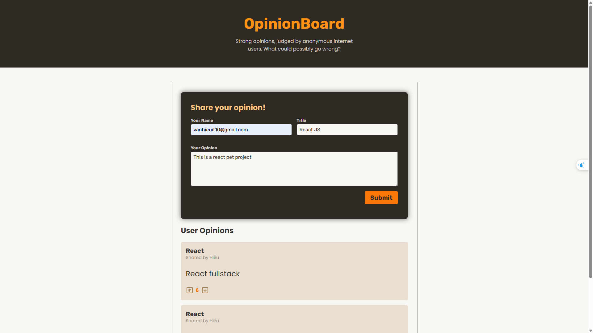

# User Opinions Application

A full-stack application for collecting and managing user opinions with voting functionality.



## Description

This application allows users to submit their opinions and vote on others' submissions. It features a modern, responsive design and real-time updates. Users can create new opinions, view existing ones, and interact with the community through a voting system.

## Features

- 📝 Create and submit opinions
- 👍 Vote on opinions
- 👥 User identification
- 📊 Opinion tracking
- 🔄 Real-time updates
- 📱 Responsive design

## Tech Stack

### Frontend
- React 19
- Vite for fast development and building
- Modern JavaScript (ES6+)
- Responsive CSS

### Backend
- Express.js
- JSON Server for data persistence
- RESTful API architecture

## Prerequisites

Before you begin, ensure you have the following installed:
- Node.js (v14 or higher)
- npm (v6 or higher)

## Installation

1. Clone the repository:
```bash
git clone <repository-url>
cd user_opinions
```

2. Install frontend dependencies:
```bash
npm install
```

3. Install backend dependencies:
```bash
cd backend
npm install
cd ..
```

## Running the Application

### Development Mode

1. Start the frontend development server:
```bash
npm run dev
```

2. In a separate terminal, start the backend server:
```bash
npm run start
```

The application will be available at `http://localhost:5173`

### Production Build

1. Create a production build:
```bash
npm run build
```

2. Preview the production build:
```bash
npm run preview
```

## Project Structure

```
user_opinions/
├── src/           # Frontend source files
├── backend/       # Backend server code
├── public/        # Static assets
├── db.json        # JSON database
└── node_modules/  # Dependencies
```

## Data Structure

Opinions are stored with the following structure:
```json
{
  "id": number,
  "votes": number,
  "userName": string,
  "title": string,
  "body": string
}
```

## Available Scripts

- `npm run dev` - Start frontend development server
- `npm run build` - Build for production
- `npm run preview` - Preview production build
- `npm run lint` - Run ESLint
- `npm run start` - Start backend server

## API Endpoints

- `GET /opinions` - Get all opinions
- `POST /opinions` - Create new opinion
- `PUT /opinions/:id` - Update opinion
- `DELETE /opinions/:id` - Delete opinion

## Code Quality

The project uses:
- ESLint for code linting
- Prettier for code formatting
- Modern JavaScript best practices

## Contributing

1. Fork the repository
2. Create your feature branch (`git checkout -b feature/AmazingFeature`)
3. Commit your changes (`git commit -m 'Add some AmazingFeature'`)
4. Push to the branch (`git push origin feature/AmazingFeature`)
5. Open a Pull Request

## License

This project is private and not licensed for public use.

## Support

For support, please open an issue in the repository or contact the development team. 